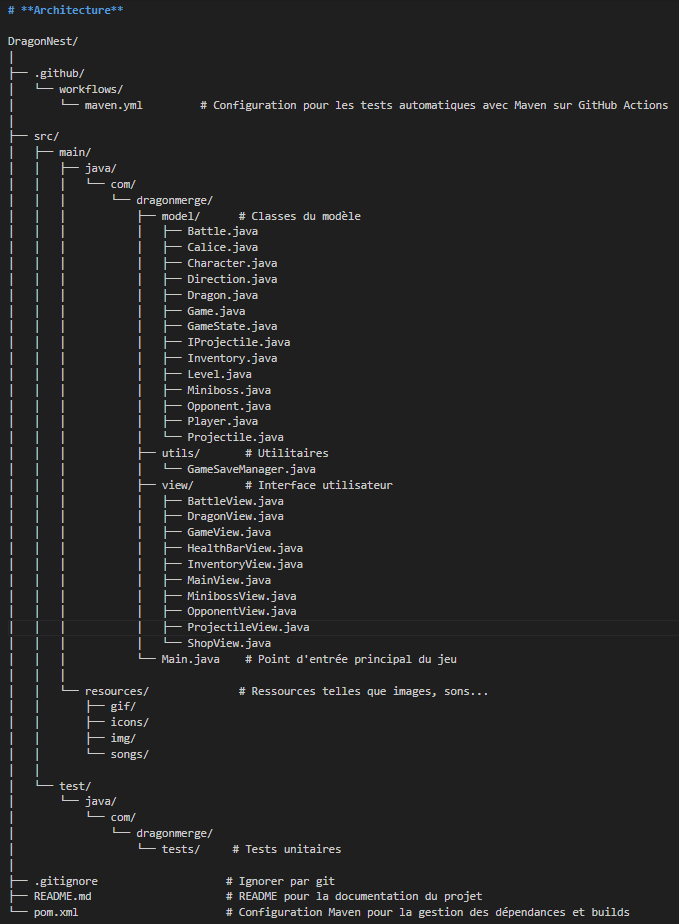
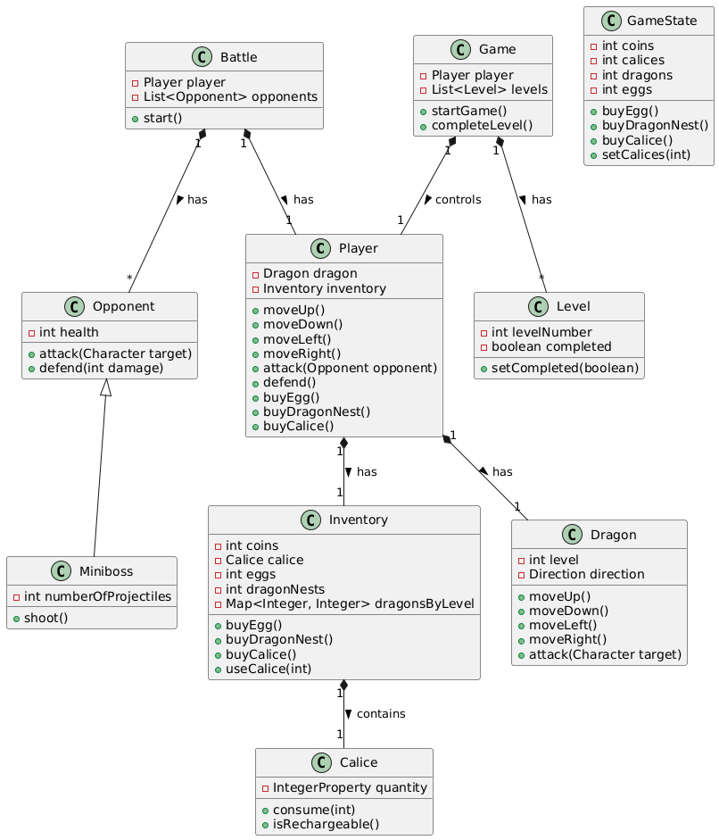
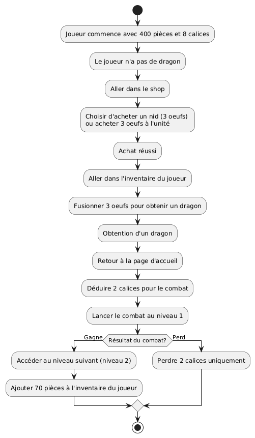

# Dragon-Nest
Projet scolaire de jeux-vidéo 2D réalisé en JAVA.

# **Techno :**
- Java23
- Maven 3.9
- JavaFX
- Github
- Junit
- JSON
- JavaDoc

# **Détail du Projet :**
## **Résumé :**
Le but du joueur est de collecter et fusionner des œufs de dragon pour créer des dragons tout en engageant des combats afin de gagner des pièces qui permettront d'acheter de nouveaux œufs dans la boutique du jeu.

Plus le joueur fusionne les dragons de même type et de même niveau, plus il progresse dans le jeu en améliorant ses dragons et en augmentant son niveau de richesse.

Le projet sera réalisé en plusieurs versions.

### **Objectif final du jeu :**
##### **Table des types**
Il existera trois types de dragons chacun ayant des forces et des faiblesses (principe pierre, feuille, ciseaux) :
**Feu** : Fort contre *Terre*, faible contre *Eau*.
**Eau** : Fort contre *Feu*, faible contre *Terre*.
**Terre** : Fort contre *Eau*, faible contre *Feu*.

Chaque type de dragon possède également des capacités uniques :
Feu : Plus de puissance d’attaque.
Eau : plus de pv.
Terre : Plus de chance de bloquer une attaque ennemie.

### Mécaniques Principales :
##### **Fusion d’Œufs et de Dragons**
_Fusion d’Œufs :_
Le joueur achète des œufs de niveau 1 qui sont classés selon un type spécifique (terre, eau, feu).
Lorsqu’il collecte 3 œufs du même type, il peut les fusionner pour créer un dragon de niveau 1 de ce type.

_Fusion de Dragons :_
Une fois un dragon de niveau 1 obtenu, le joueur peut continuer à fusionner 3 dragons de même niveau et de même type pour créer un dragon de niveau supérieur dans la même catégorie.

_Exemple_ : 3 dragons de type feu et de niveau 1 fusionnent pour créer un dragon de type feu de niveau 2.
IL FAUT TOUJOURS 3 ELEMENTS POUR FUSIONNER !

##### **Combats**
- Une seule map.
- Niveau de 1 à 100.
- Tous les 10 niveaux tu rencontres un mini-boss, et tous les 50 niveaux un GRAND boss.
+ Chaque niveau réussies apporte des récompenses :
    - Niveau lambda tu gagnes 60 pièces.
    - les mini-boss rapportent un oeuf type aleatoire en plus des pieces. 
    - Le GRAND boss gagne juste un nid de 3 oeufs et pas de pièces. (2 grands boss).

##### **Système d'énergie - Les Calices**
- Les calices représentent l'énergie necessaires pour engager des combats.
- Chaque combats consomment 2 calices.
- Le nombre maximum de calices est de 8.
- Les calices se rechargent automatiquement dans le temps. il faut 2 heures pour recharger au max soit 15 minutes par calice.
- Le joueur peut aussi acheter des calices supplémentaires dans la boutique pour 70 pièces.

##### **Système Monétaire**
- Le joueur commence le jeu avec **400 pièces**.
- il lui restera donc 40 pièces.
- Un oeuf coûte **130 pièces** dans la boutique, quelque soit son type.
- Un nid coûte **360 pièces**.
- Le joueur peut obtenir des pièces en gagnant des combats (70 par combats hors GRAND Boss).
- Le joueur peut acheter une calice pour 70 pièces.

### **Version 1:** _Tester les fonctionnalitées_
Dragon basique type normal pas de forces ou faiblesses en particulier.

un seul sprites pour représenter les dragons. Les ennemies seront d'une couleur diférente.

On part sur 3 niveaux de jeu.

On garde le concept de 400 pieces au démarrage pour acheter un premier nid de 3 oeufs de départ -> 360 pieces donc reste 40 pièces.

Un combat coûte 2 calices pour être lancé.

Après un combat, soit tu gagnes et tu obtiens 70 pièces, soit tu perds et t'as juste perdu les 2 calices.

8 calices en tout qui se rechargent complètement toutes les 2 heures (1 calice toutes les 15 minutes)
Les combats se feront dans une arène qui prendra toute la fenêtre pout le moment.

On part sur 100 points de vie pendant le combat.

1 coup d’attaque = -10 pv.

1 coup de defense = -5 pv (lorsque le dragon se "défend", il perds moins de pv).

Les dragons peuvent bouger, haut bas gauche droite et attaquer dans la direction dans laquelle ils regardent.

On joue toujours contre une ia qui se déplace aléatoirement.

ils envoient des "missiles" dans une direction qui seront rectilignes et qui auront un temps de chargement de une seconde après chaque utilisation.

On a préparé la boutique. Achat d'oeuf, de nid et de calices (130, 360 et 70 pièces).

On a établie la fusion d'oeufs, 3 oeufs se transforment en un dragon qui s'ajoute à la liste de dragons présents dans l'inventaire du joueur.

Si le joueur n'a pas assez d'oeufs, il ne peut pas fusionner.

### **Version 2:** _Tester les Views_
Ajout du sprite pour le mini-boss.

Création de la "map" des niveaux.

On a mit 2 adversaires pour certains niveaux.

On a ajouté des pv aux adversaires et de la vitesse en fonction des levels.

L'arène de combat est recentrée. Affichage de la barre de vie des dragons. 

Ajout du menu pause pendant le combat. 

Affichage du you win et you loose à la fin du combat.

Création des pages de l'inventaire et du shop avec affichage des ressources et options fonctionnelles (sans modales pour l'instant).

### **Version 3:**  _Insertiton des dernieres fonctionnalités et peaufinage des Views pour que le jeu puisse être distribué en l'état_

On a 5 niveaux en tout.

Amélioration du Mini-Boss. Ajout d'un adversaire lambda qui accompagne le Mini-Boss.

Le joueur ne peut pas engager de combat s'il n'a pas de calice.

Intégration du système de sauvegarde (ressources, niveaux réussies et niveau actuel).

Tant que le joueur n'a pas gagné un niveau, il ne peut pas jouer les niveaux le suivant. En revanche, tant qu'il a passé un niveau il peut jouer à nouveau les niveaux le précédent.

Lorsqu'on quitte un niveau, le dragon reste placé sur ce niveau. De même quand on quitte le jeu, au redémarrage, le dragon reste placé sur le dernier niveau joué et on peut toujours jouer les niveaux déjà reussis qu'il soient avant ou après le dernier niveau joué.

Dans le shop on peut acheter des oeufs, des nids et des calices avec les modales de confirmation ou d'empechement d'achats (si pas assez de pièces ou si Calices déjà au max).
Un petit easter-egg est intégré dans le shop.

Dans l'inventaire, on peut voir les ressources actuelles et on peut fusionner nos oeufs pour obtenir un dragon supplémentaire avec une modale de confirmation ou d'empechement de fusion en fonction des ressources possédées.

Ajout d'une musique dans la page du choix de niveau, shop et inventaire. Ainsi qu'une musique pendant un combat.

Ces musiques sont accompagnés d'un bouton "mute" qui met en pause la musique.

On peut quitté le combat et revenir au choix du niveau. Les calices seront quand même dépensés et le dragon se positionnera sur le niveau quitté.

On a différentes manière de jouer (ZQSD ou flèches pour se déplacer) un bouton C pour modifier le mode de déplacement.

On affiche toutes les commandes de jeu dans le menu pause.

# **Architecture**

DragonNest/
│
├── .github/
│   └── workflows/
│       └── maven.yml         # Configuration pour les tests automatiques avec Maven sur GitHub Actions
│
├── src/
│   ├── main/
│   │   ├── java/
│   │   │   └── com/
│   │   │       └── dragonmerge/
│   │   │           ├── model/      # Classes du modèle
│   │   │           │   ├── Battle.java
│   │   │           │   ├── Calice.java
│   │   │           │   ├── Character.java
│   │   │           │   ├── Direction.java
│   │   │           │   ├── Dragon.java
│   │   │           │   ├── Game.java
│   │   │           │   ├── GameState.java
│   │   │           │   ├── IProjectile.java
│   │   │           │   ├── Inventory.java
│   │   │           │   ├── Level.java
│   │   │           │   ├── Miniboss.java
│   │   │           │   ├── Opponent.java
│   │   │           │   ├── Player.java
│   │   │           │   └── Projectile.java
│   │   │           ├── utils/       # Utilitaires
│   │   │           │   └── GameSaveManager.java
│   │   │           ├── view/        # Interface utilisateur
│   │   │           │   ├── BattleView.java
│   │   │           │   ├── DragonView.java
│   │   │           │   ├── GameView.java
│   │   │           │   ├── HealthBarView.java
│   │   │           │   ├── InventoryView.java
│   │   │           │   ├── MainView.java
│   │   │           │   ├── MinibossView.java
│   │   │           │   ├── OpponentView.java
│   │   │           │   ├── ProjectileView.java
│   │   │           │   └── ShopView.java
│   │   │           └── Main.java    # Point d'entrée principal du jeu
│   │   │
│   │   └── resources/              # Ressources telles que images, sons...
│   │       ├── gif/
│   │       ├── icons/
│   │       ├── img/
│   │       └── songs/
│   │
│   └── test/
│       └── java/
│           └── com/
│               └── dragonmerge/
│                   └── tests/     # Tests unitaires
│
├── .gitignore                    # Ignorer par git
├── README.md                     # README pour la documentation du projet
└── pom.xml                       # Configuration Maven pour la gestion des dépendances et builds

# **Diagramme de Classes**

# **Diagramme d'activité**

